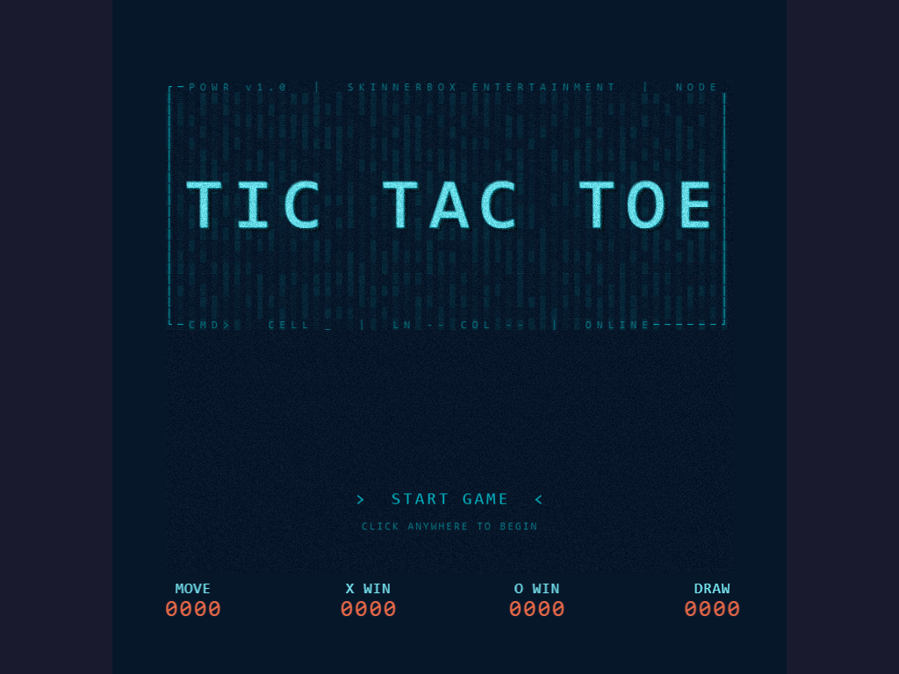
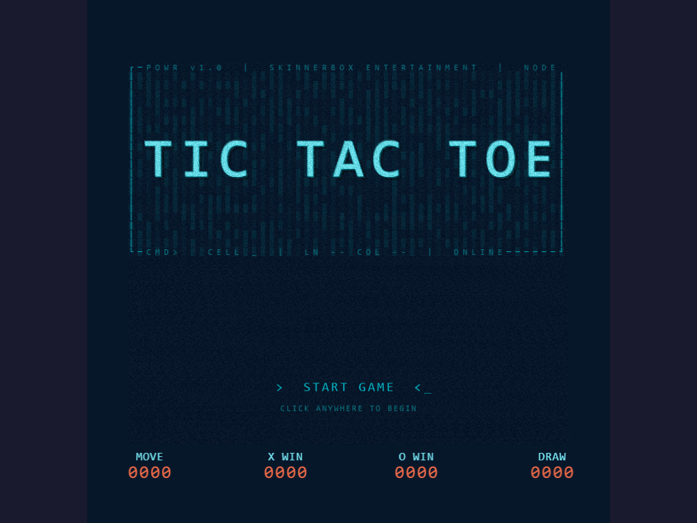
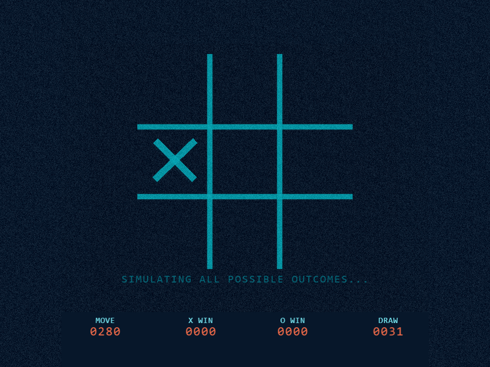
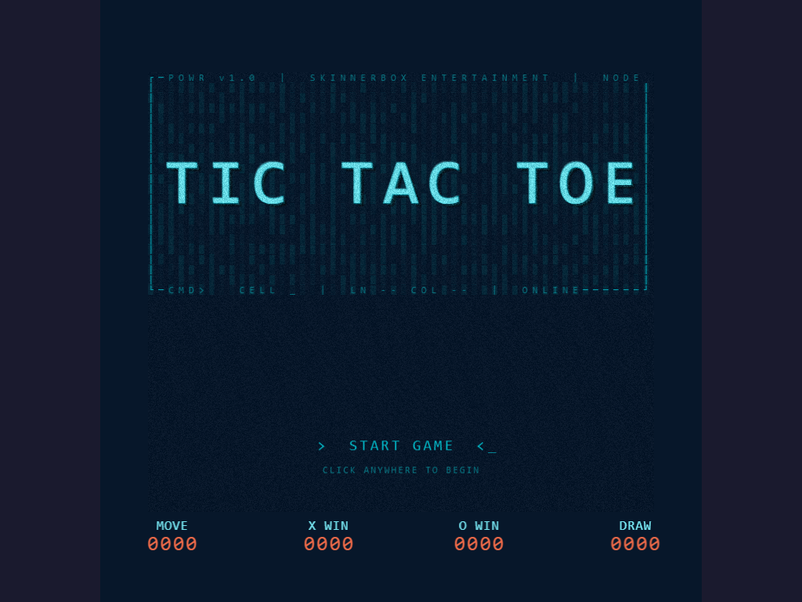

<p align="center">
  <h1 align="center">POWR Terminal — Tic-Tac-Toe</h1>
  <p align="center">
    <em>A Cold War military CRT terminal playing tic-tac-toe.</em>
    <br />
    WarGames aesthetic. Minimax AI. Hidden simulation mode.
    <br />
    <a href="#quick-start"><strong>Quick start »</strong></a>
    <br />
    <br />
    <a href="LICENSE"></a>
    <a href="https://vite.dev"></a>
    <a href="https://pixijs.com"></a>
    <a href="https://www.typescriptlang.org"></a>
  </p>
</p>

---

## Screenshots

<p align="center">
  
  
  <br />
  
  
</p>

## Overview

Single-player tic-tac-toe presented as a classified military computer terminal. The player is X, the computer is O, using an unbeatable minimax strategy with alpha-beta pruning. Every game is a hard-fought draw unless the player makes a mistake.

The interface simulates a Cold War CRT display — ice-blue phosphor on near-black navy, scanlines, vignette, analog noise, and a dual-layer simplex-noise "phosphor ghost" banner that responds to cursor movement.

Typing **POWR** on the title screen triggers a hidden self-play simulation: the AI plays itself at accelerating speed until every possible board state is exhausted, then reveals *"THE ONLY WINNING MOVE IS NOT TO PLAY."*

## Quick Start

```bash
npm install
npm run dev
```

Open `http://localhost:5173` in a browser. Click any cell to place X. The AI responds with O.

## Controls

| Input | Action |
|-------|--------|
| **Click** an empty cell | Place X |
| **Click** after game over | Play again |
| **Type `POWR`** on title screen | Trigger simulation mode |

## Project Structure

```
src/
  main.ts                  — PixiJS init, scene manager, game loop
  core/
    scene-manager.ts       — Stack-based scene manager
    input-manager.ts       — Keyboard + mouse capture, frame-buffered
    config.ts              — Typed config loader from JSON
    terminal-grid.ts       — CP437 character grid for UI text
    simplex-noise.ts       — 2D noise field for organic texture
    session-stats.ts       — Persistent session counters
  scenes/
    boot-scene.ts          — Loading screen, config init
    title-scene.ts         — Terminal frame, extruded logo, phosphor banner, prompt
    game-scene.ts          — Game board, AI, typewriter overlay
    simulation-scene.ts    — Self-play demo, acceleration, flash, revelation
  gameplay/
    tic-tac-toe-state.ts   — Plain-class state model (board, turns, win detection)
    ai.ts                  — Minimax with alpha-beta pruning
    board-renderer.ts      — CRT housing, grid, marks, scanlines, vignette, status panel
  audio/
    audio-manager.ts       — Howler.js wrapper + jsfxr procedural generation
    audio-manager.interface.ts
design/
  auto-build-spec.md       — Technical spec for rebuild
  auto-build-natural.md    — Natural language design brief
  ansi-terminal-aesthetic-reference.md  — Terminal aesthetic research
  zero-player-simulation.md            — WOPR simulation design
  simplex-noise-banner.md              — Banner effect design
assets/
  data/gameplay-config.json  — All tunable values (colors, sizes, timing, layout)
  audio/sfx/                 — OGG sound effects
  ui/fonts/                  — Orbitron Black (self-hosted)
```

## Tech Stack

- **Renderer:** [PixiJS v8](https://pixijs.com) — WebGL/WebGPU/Canvas
- **Language:** TypeScript (strict mode)
- **Build:** [Vite](https://vite.dev)
- **Testing:** [Vitest](https://vitest.dev)
- **Audio:** [Howler.js](https://howlerjs.com) + [jsfxr](https://github.com/mneubrand/jsfxr) procedural SFX
- **Font:** [Orbitron Black](https://fonts.google.com/specimen/Orbitron) via `@font-face`

## Design

All visual parameters are in `assets/data/gameplay-config.json`. Colors use an ice-blue palette:

```
background      #07182B  (dark navy)
grid cyan       #00B7C7  (main phosphor)
ice blue        #77E6F2  (bright edge)
status numbers  #F06B49  (orange-red missile-command)
```

The title screen logo is built from 7 stacked Text layers (shadow → extrusion → face → core → rim → glow) with per-character positioning and a BlurFilter bloom.

The terminal frame is drawn on a 50×22 TerminalGrid using CP437 characters with intentional gaps and dashes for a degraded analog feel.

## Credits

Inspired by the WOPR terminal scene in *WarGames* (1983). Built with [OpenCode](https://opencode.ai) AI agents.

## License

MIT License. See [LICENSE](LICENSE) for details.
